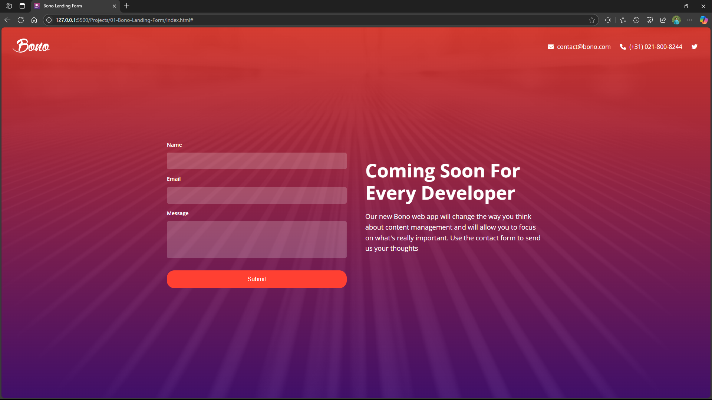
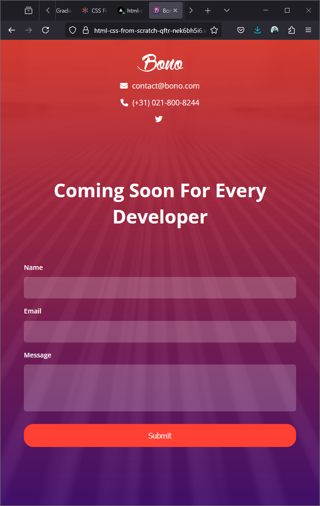
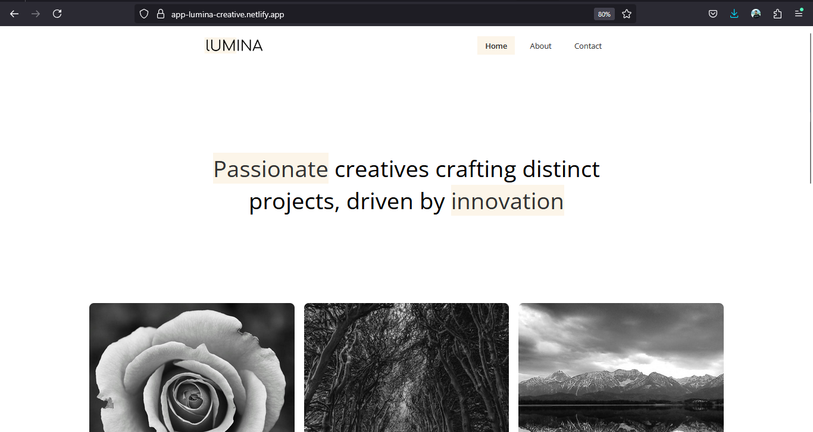
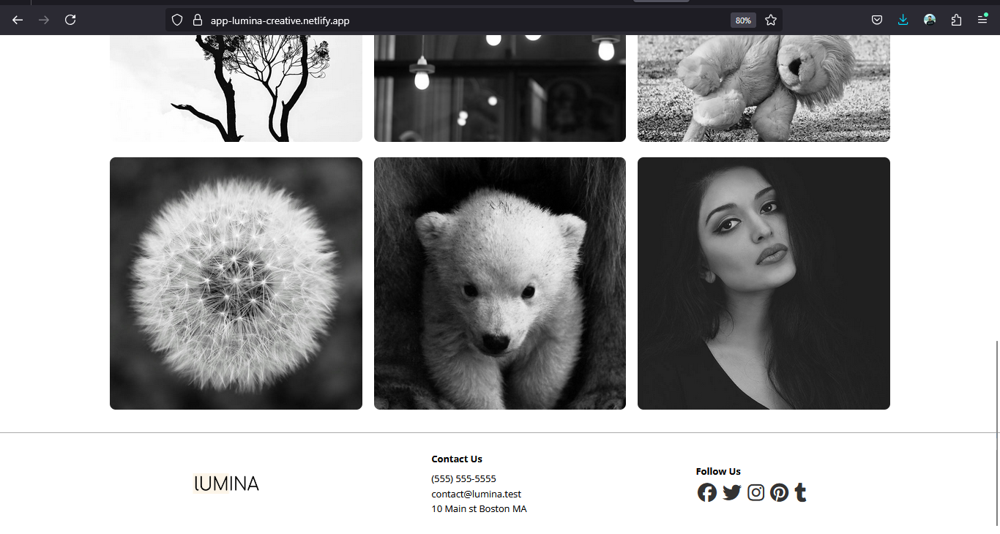
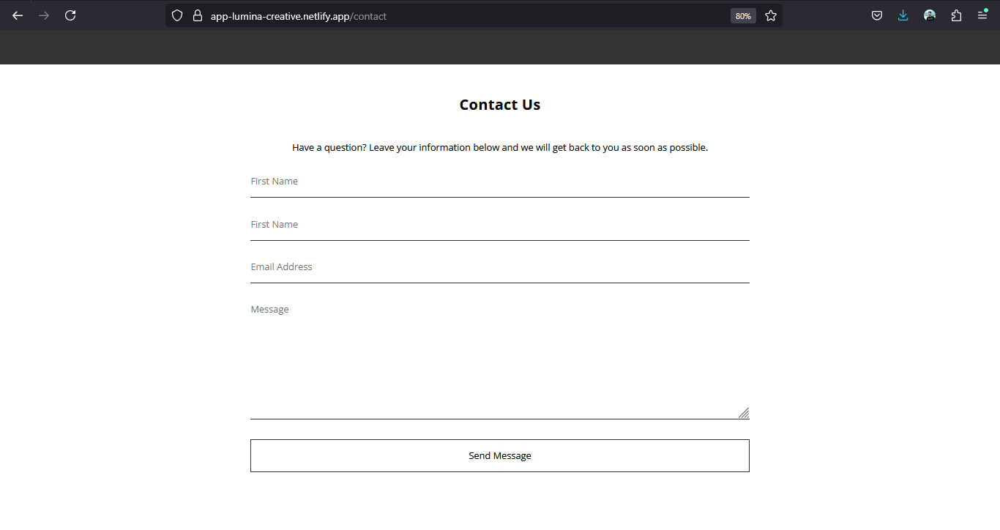
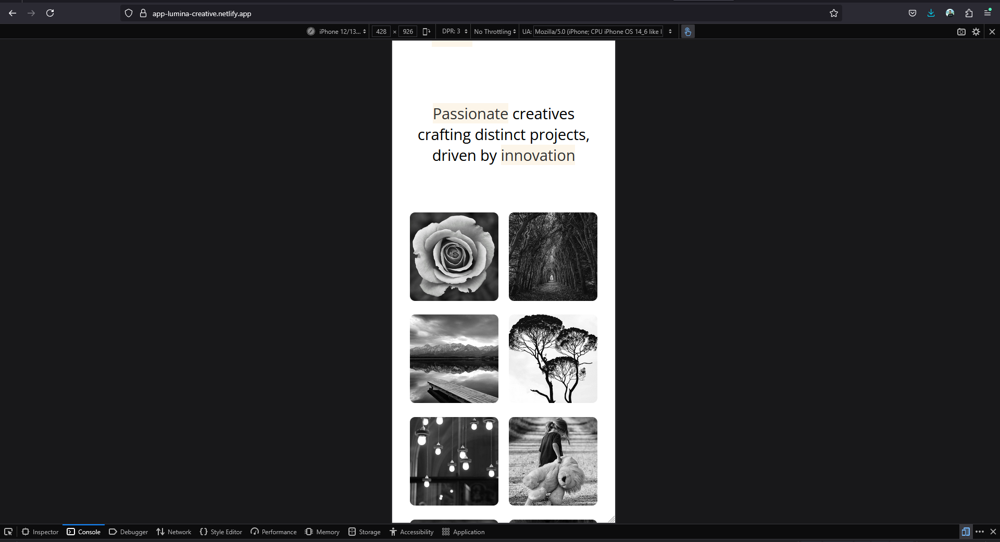
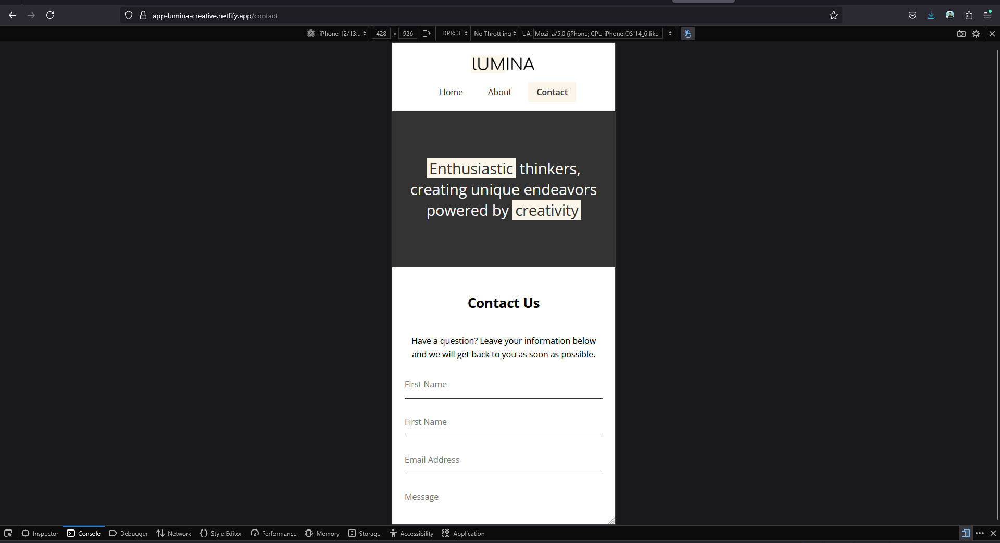
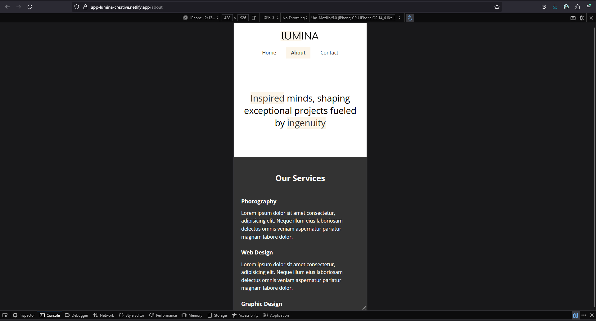

# Modern HTML & CSS – From The Beginning

This repository documents my learning journey through the [Modern HTML & CSS From The Beginning](https://www.udemy.com/course/modern-html-css-from-the-beginning/) course on Udemy.

## My Goals

- Build a solid foundation in HTML & CSS
- Complete all projects and exercises
- Regularly commit changes to GitHub for practice and accountability

## Projects
### 1. Bono Landing Form (Webapp)
- Live Link: [Go To the website](https://html-css-from-scratch-qftr.vercel.app/)
- Source Code: [Visit Github](https://github.com/capt-farvez/html-css-from-scratch/tree/main/Projects/01-Bono-Landing-Form)

### 2. Lumina Creative Website
- Live link: [Go to the site](https://app-lumina-creative.netlify.app/)
- Source Code: [Visit Github](https://github.com/capt-farvez/html-css-from-scratch/tree/main/Projects/02-Lumina-Creative-Website)

